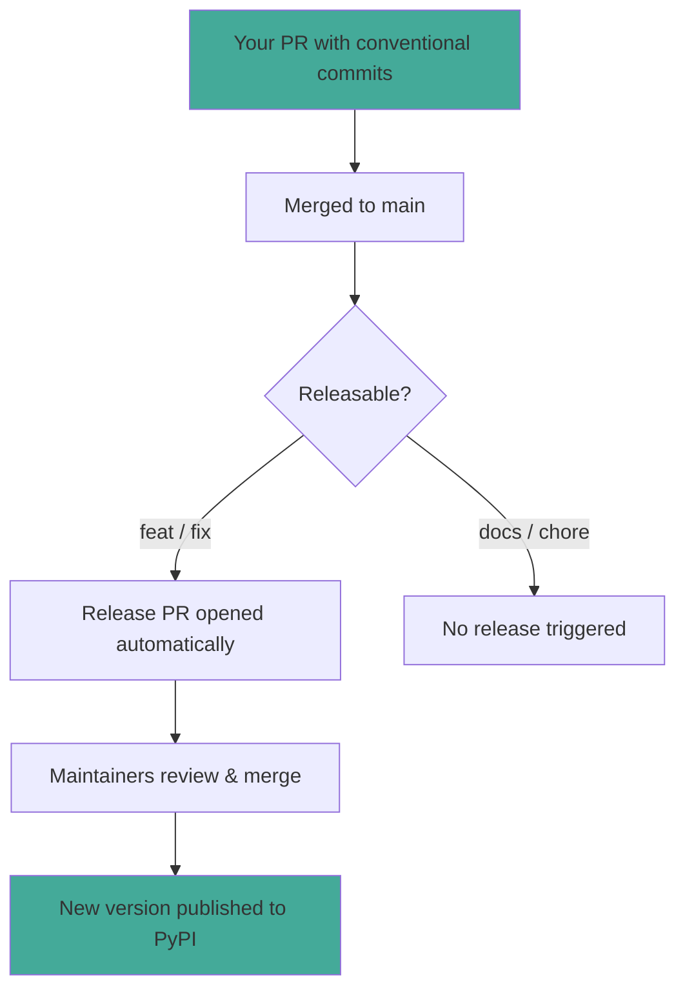

# Releases

How Dedalus MCP releases work and how your contributions become published packages.

## How Releases Work

We use [release-please](https://github.com/googleapis/release-please) to automate versioning and changelog generation.

You don't need to do anything special—just write good [conventional commit](docs/conventional-commits.md) messages.

## Your Commits Determine the Version

Your commit messages directly affect the next release version:

| Your Commit | Version Bump | Example |
|-------------|--------------|---------|
| `feat:` | Minor (0.**X**.0) | `feat: add streaming support` |
| `fix:` | Patch (0.0.**X**) | `fix: handle empty response` |
| `feat!:` | Major (**X**.0.0) | `feat!: new API` |
| `docs:`, `test:`, `chore:` | No release | `docs: update examples` |

## What Happens After Your PR Merges

1. **If your commit is releasable** (`feat:` or `fix:`), release-please includes it in the next release PR
2. **The release PR accumulates changes** until maintainers decide to release
3. **When released**, your contribution appears in the [CHANGELOG](CHANGELOG.md) and the new version goes to PyPI

You don't need to do anything else. The automation handles versioning, changelogs, and publishing.

## Package Versions vs. Protocol Versions

Dedalus MCP package versions (e.g., `1.2.3`) are independent of MCP protocol versions (e.g., `2025-06-18`). A single package version can support multiple protocol versions. See [versioning.md](docs/openmcp/versioning.md) for details.

## Questions?

- [CONTRIBUTING.md](CONTRIBUTING.md) — how to submit PRs
- [Conventional Commits](docs/conventional-commits.md) — commit message format
- [GitHub Discussions](https://github.com/dedalus-labs/openmcp-python/discussions) — ask questions
