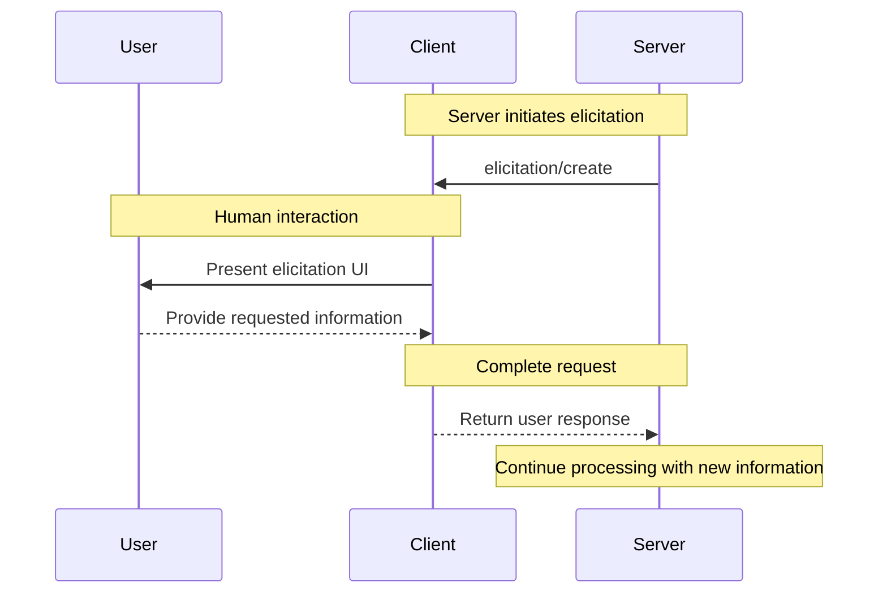

## Message Flow

```mermaid
sequenceDiagram
    participant User
    participant Client
    participant Server

    Note over Server,Client: Server initiates elicitation
    Server->>Client: elicitation/create

    Note over Client,User: Human interaction
    Client->>User: Present elicitation UI
    User-->>Client: Provide requested information

    Note over Server,Client: Complete request
    Client-->>Server: Return user response

    Note over Server: Continue processing with new information
```
