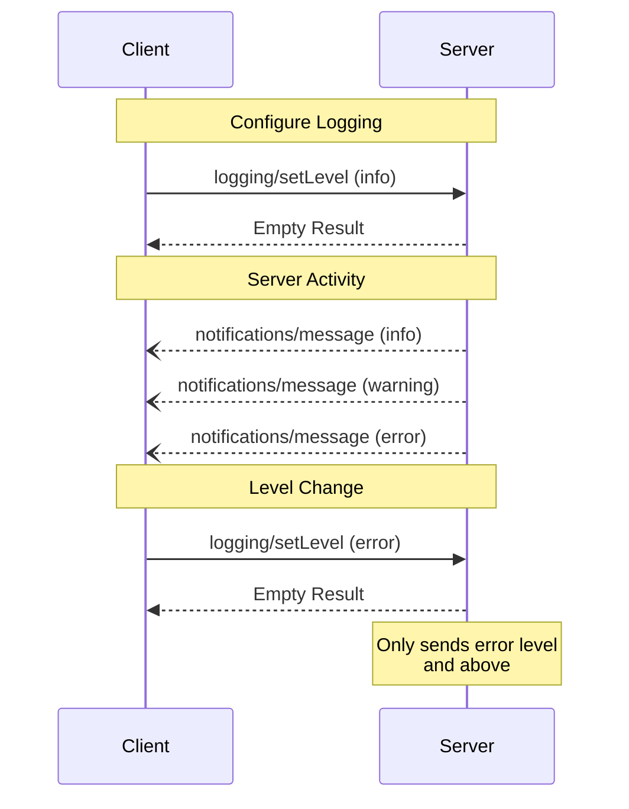

## Message Flow

```mermaid
sequenceDiagram
    participant Client
    participant Server

    Note over Client,Server: Configure Logging
    Client->>Server: logging/setLevel (info)
    Server-->>Client: Empty Result

    Note over Client,Server: Server Activity
    Server--)Client: notifications/message (info)
    Server--)Client: notifications/message (warning)
    Server--)Client: notifications/message (error)

    Note over Client,Server: Level Change
    Client->>Server: logging/setLevel (error)
    Server-->>Client: Empty Result
    Note over Server: Only sends error level<br/>and above
```
