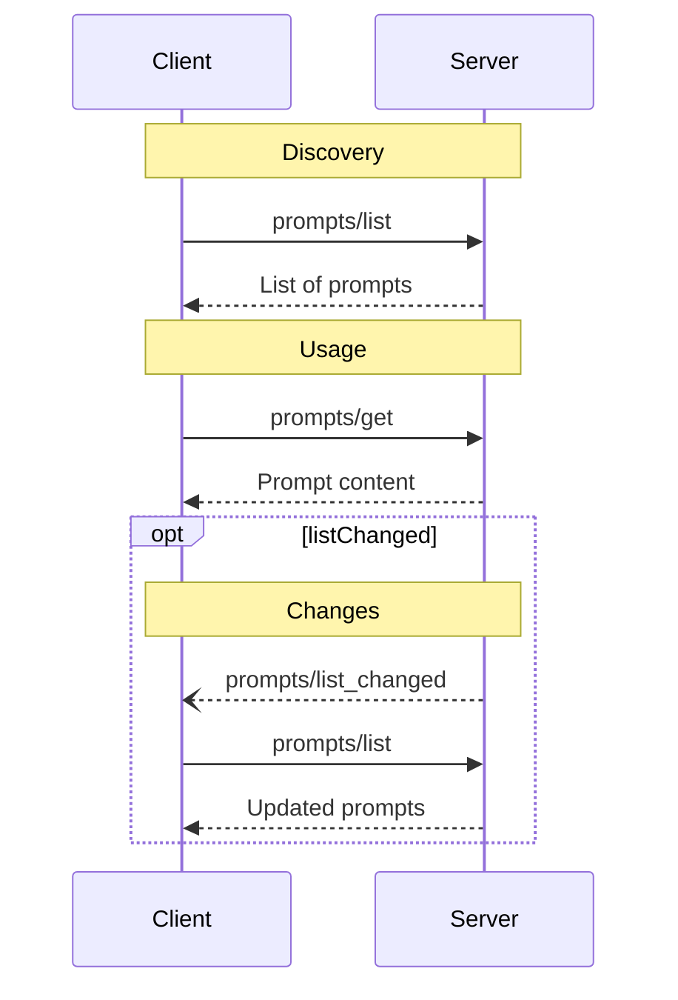

## Message Flow

```mermaid
sequenceDiagram
    participant Client
    participant Server

    Note over Client,Server: Discovery
    Client->>Server: prompts/list
    Server-->>Client: List of prompts

    Note over Client,Server: Usage
    Client->>Server: prompts/get
    Server-->>Client: Prompt content

    opt listChanged
      Note over Client,Server: Changes
      Server--)Client: prompts/list_changed
      Client->>Server: prompts/list
      Server-->>Client: Updated prompts
    end
```
