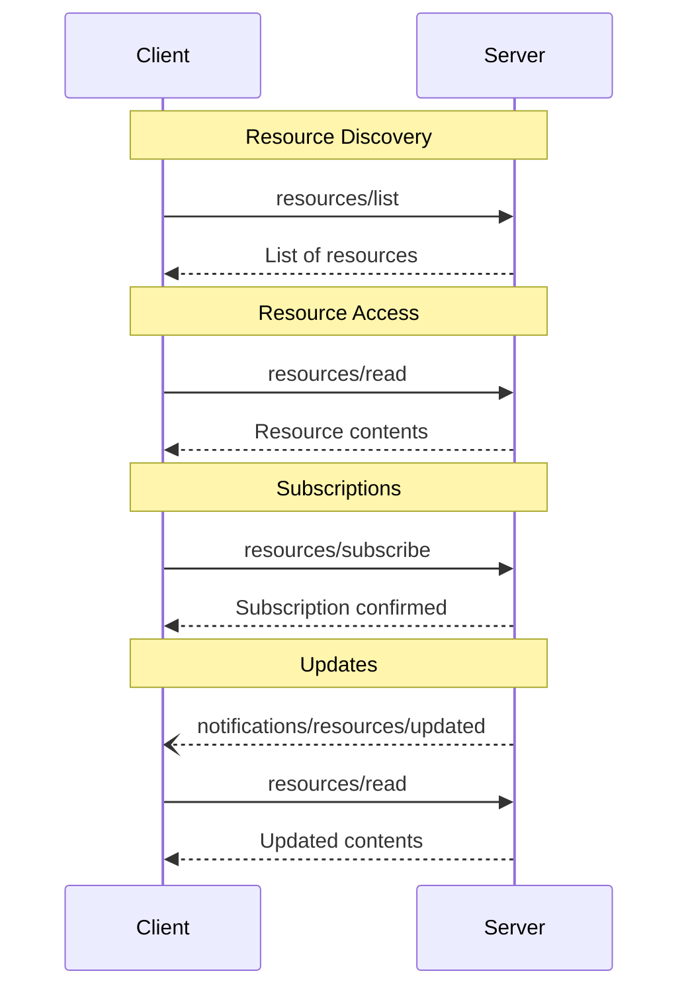

## Message Flow

```mermaid
sequenceDiagram
    participant Client
    participant Server

    Note over Client,Server: Resource Discovery
    Client->>Server: resources/list
    Server-->>Client: List of resources

    Note over Client,Server: Resource Access
    Client->>Server: resources/read
    Server-->>Client: Resource contents

    Note over Client,Server: Subscriptions
    Client->>Server: resources/subscribe
    Server-->>Client: Subscription confirmed

    Note over Client,Server: Updates
    Server--)Client: notifications/resources/updated
    Client->>Server: resources/read
    Server-->>Client: Updated contents
```

