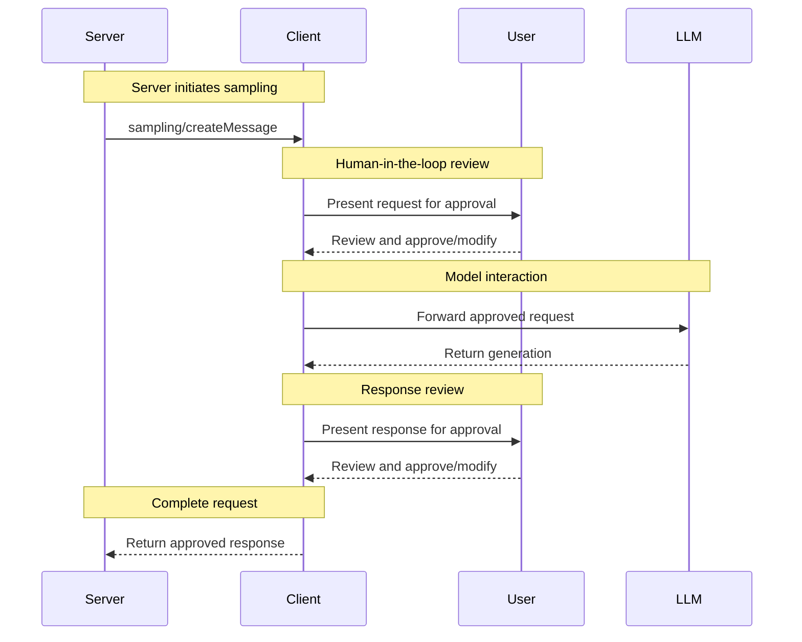

## Message Flow

```mermaid
sequenceDiagram
    participant Server
    participant Client
    participant User
    participant LLM

    Note over Server,Client: Server initiates sampling
    Server->>Client: sampling/createMessage

    Note over Client,User: Human-in-the-loop review
    Client->>User: Present request for approval
    User-->>Client: Review and approve/modify

    Note over Client,LLM: Model interaction
    Client->>LLM: Forward approved request
    LLM-->>Client: Return generation

    Note over Client,User: Response review
    Client->>User: Present response for approval
    User-->>Client: Review and approve/modify

    Note over Server,Client: Complete request
    Client-->>Server: Return approved response
```

