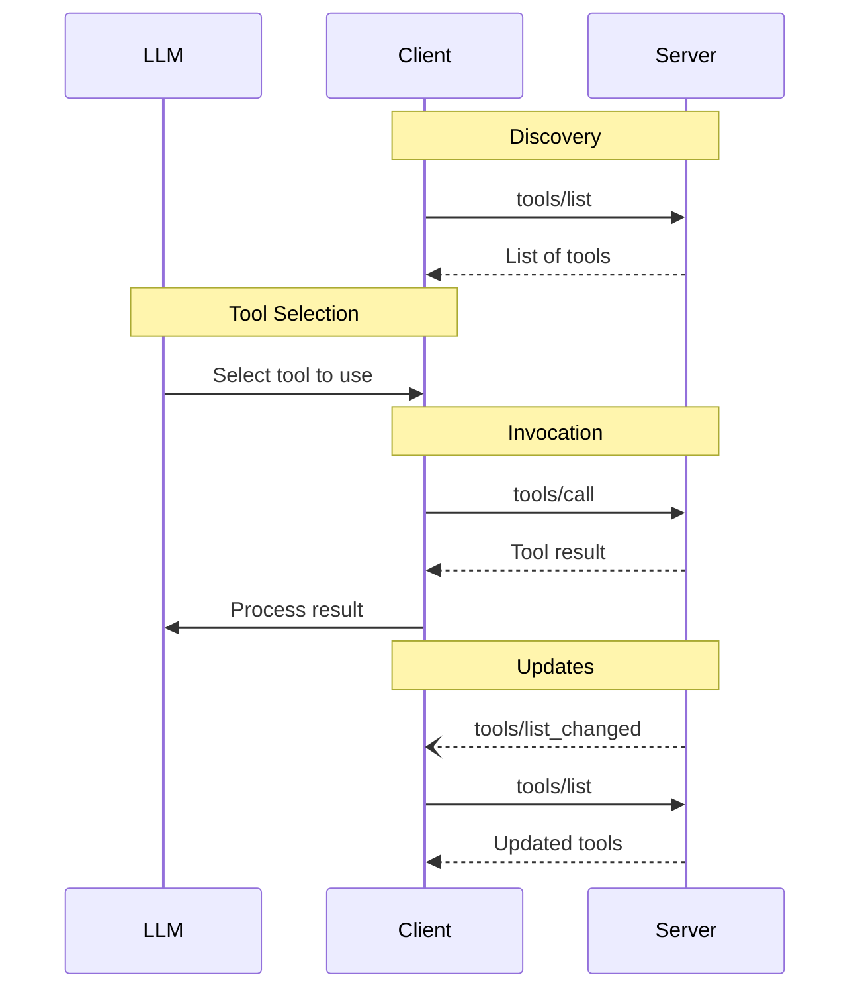

## Message Flow

```mermaid
sequenceDiagram
    participant LLM
    participant Client
    participant Server

    Note over Client,Server: Discovery
    Client->>Server: tools/list
    Server-->>Client: List of tools

    Note over Client,LLM: Tool Selection
    LLM->>Client: Select tool to use

    Note over Client,Server: Invocation
    Client->>Server: tools/call
    Server-->>Client: Tool result
    Client->>LLM: Process result

    Note over Client,Server: Updates
    Server--)Client: tools/list_changed
    Client->>Server: tools/list
    Server-->>Client: Updated tools
```
