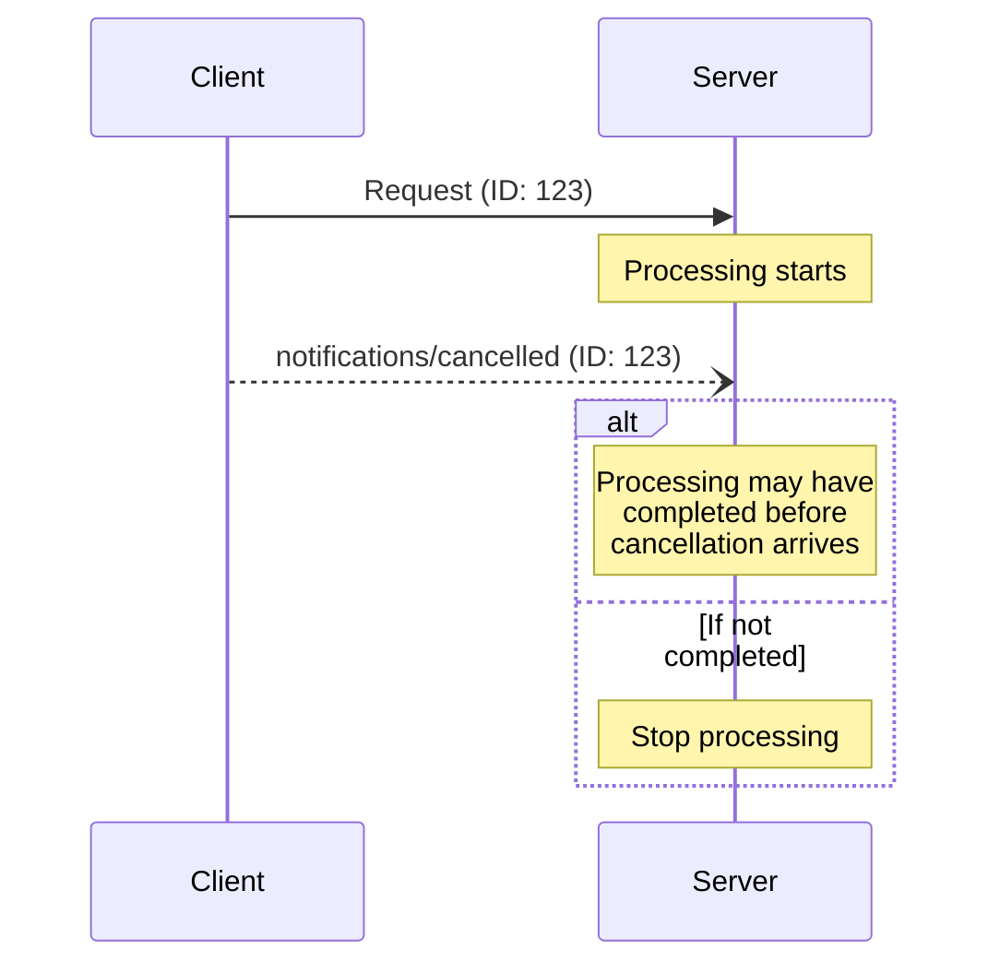

## Timing Considerations

Due to network latency, cancellation notifications may arrive after request processing
has completed, and potentially after a response has already been sent.

Both parties **MUST** handle these race conditions gracefully:

