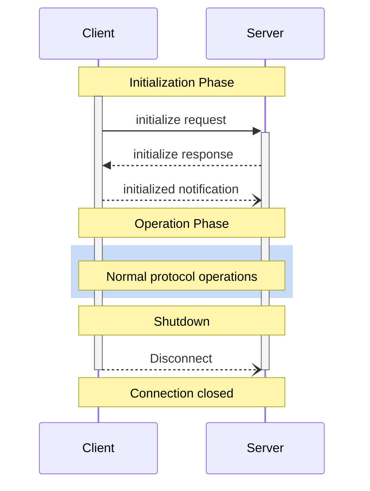

# Lifecycle
Source: https://modelcontextprotocol.io/specification/2025-06-18/basic/lifecycle

<Info>**Protocol Revision**: 2025-06-18</Info>

The Model Context Protocol (MCP) defines a rigorous lifecycle for client-server
connections that ensures proper capability negotiation and state management.

1. **Initialization**: Capability negotiation and protocol version agreement
2. **Operation**: Normal protocol communication
3. **Shutdown**: Graceful termination of the connection

