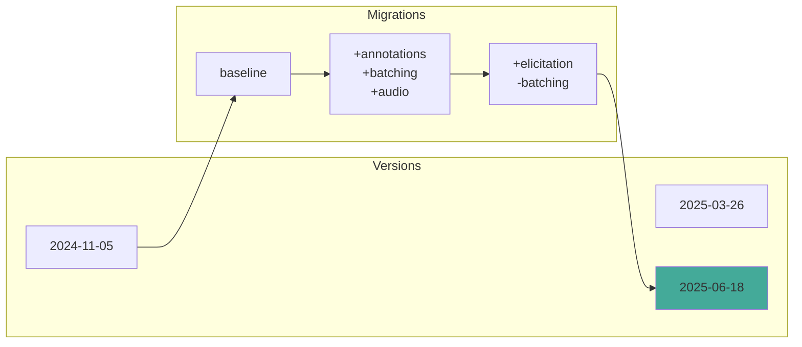
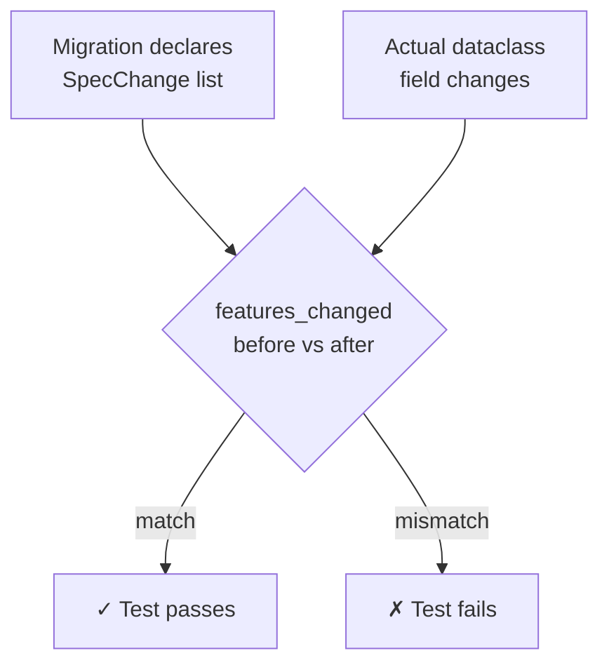

# Protocol Version Tests

Version-specific tests verifying Dedalus MCP against each MCP protocol revision.

## How It Works



Each version folder contains tests that verify features for that specific protocol revision.

## Directory Structure

```
tests/protocol_versions/
├── conftest.py              # Shared fixtures
├── 2024_11_05/              # First public release
│   ├── schema.json
│   └── test_features_2024_11_05.py
├── 2025_03_26/              # OAuth, Streamable HTTP
│   ├── schema.json
│   └── test_features_2025_03_26.py
└── 2025_06_18/              # Elicitation, structured output
    ├── schema.json
    └── test_features_2025_06_18.py
```

## Testing Features

Use `ProtocolProfile` to check feature availability:

```python
from dedalus_mcp.versioning import FeatureId, ProtocolProfile, V_2025_03_26

def test_progress_message_field():
    profile = ProtocolProfile.for_version(V_2025_03_26)
    assert profile.supports(FeatureId.PROGRESS_MESSAGE_FIELD)
```

For features that were removed:

```python
from dedalus_mcp.versioning import Availability, FeatureId, ProtocolProfile, V_2025_06_18

def test_batching_removed():
    profile = ProtocolProfile.for_version(V_2025_06_18)
    assert not profile.supports(FeatureId.JSONRPC_BATCHING)
    assert profile.feature_state(FeatureId.JSONRPC_BATCHING) is Availability.REMOVED
```

## Migration Drift Detection



The `test_migrations_match_declared_changes` test catches drift between declared changes and actual code changes.

## Adding a New Version

1. Create directory: `tests/protocol_versions/2025_09_01/`

2. Add `__init__.py` and `schema.json`

3. Add feature tests:

```python
# test_features_2025_09_01.py
from dedalus_mcp.versioning import FeatureId, ProtocolProfile, V_2025_09_01

def test_new_feature():
    profile = ProtocolProfile.for_version(V_2025_09_01)
    assert profile.supports(FeatureId.SOME_NEW_FEATURE)
```

4. Update `src/openmcp/versioning.py`:
   - Add `V_2025_09_01 = ProtocolVersion.parse("2025-09-01")`
   - Add migration with `SpecChange` entries
   - Add new `FeatureId` values if needed

## Running Tests

```bash
# All protocol version tests
uv run pytest tests/protocol_versions/

# Specific version
uv run pytest tests/protocol_versions/2025_06_18/

# Migration drift detection
uv run pytest tests/test_feature_registry.py -k drift
```

## See Also

- [Versioning module](../../src/openmcp/versioning.py)
- [Versioning guide](../../docs/openmcp/versioning.md)
